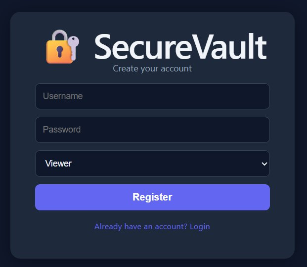
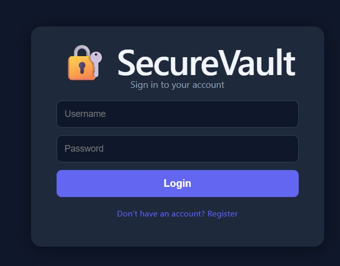
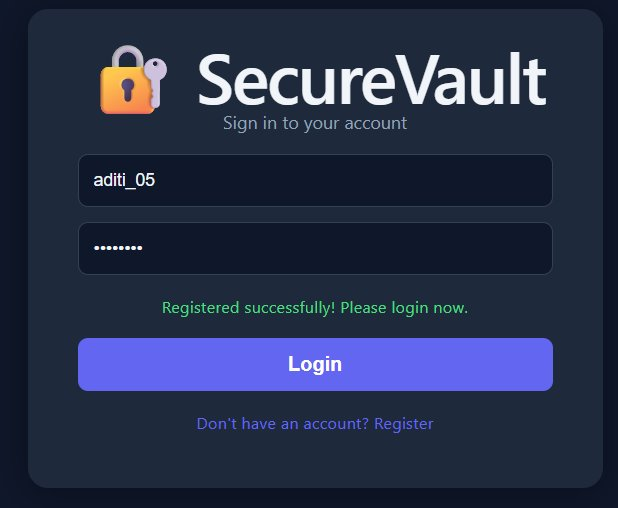
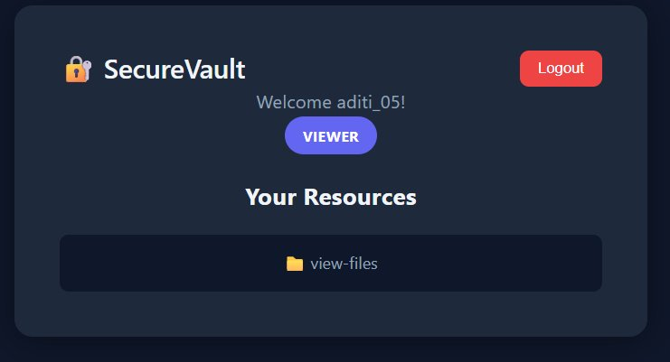
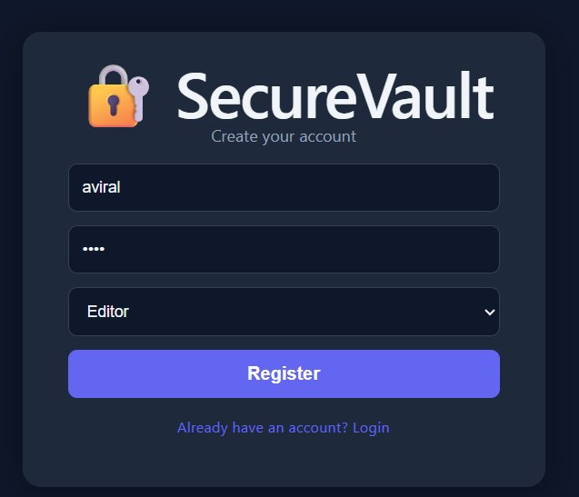
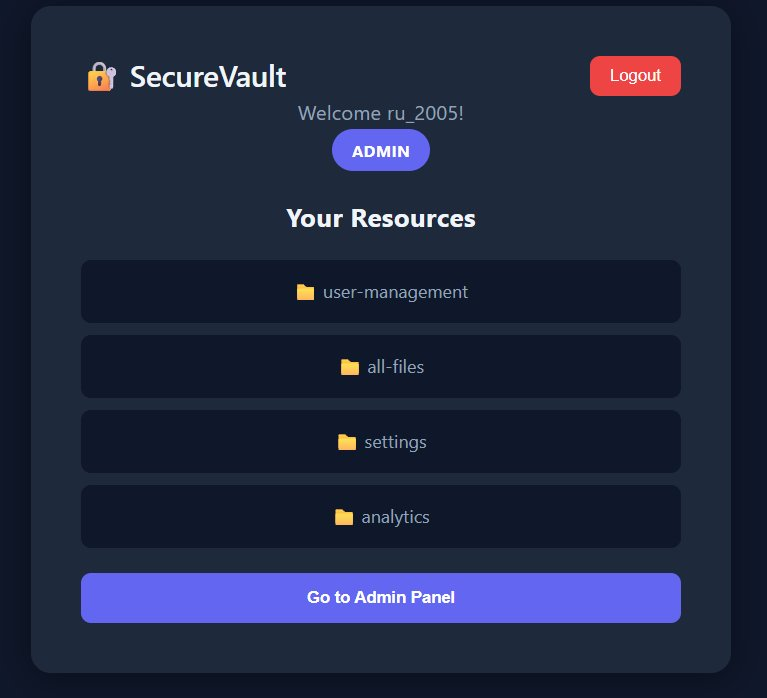
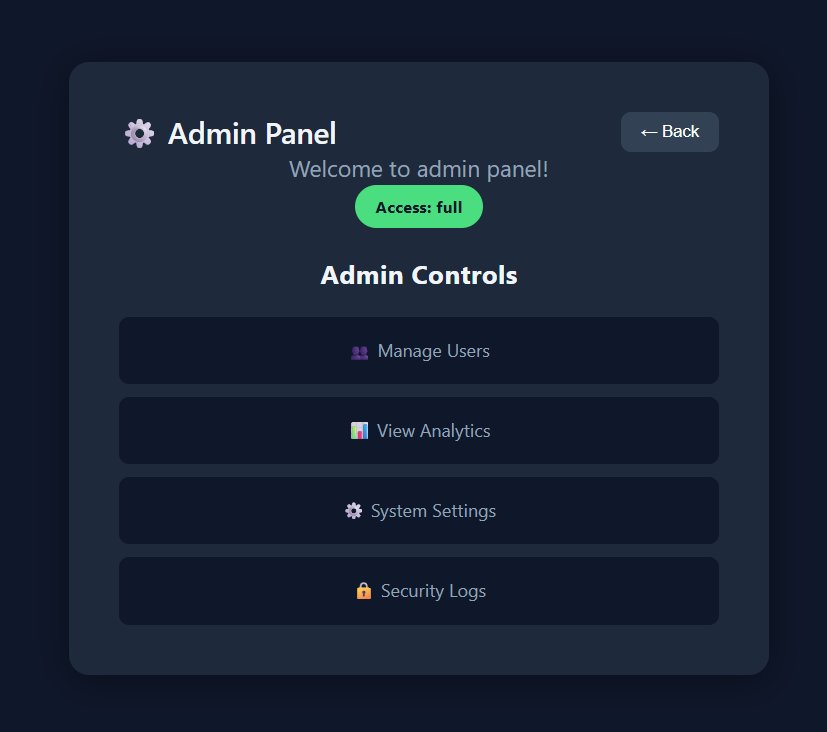
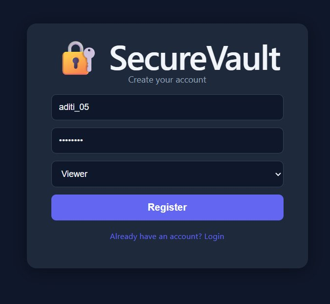
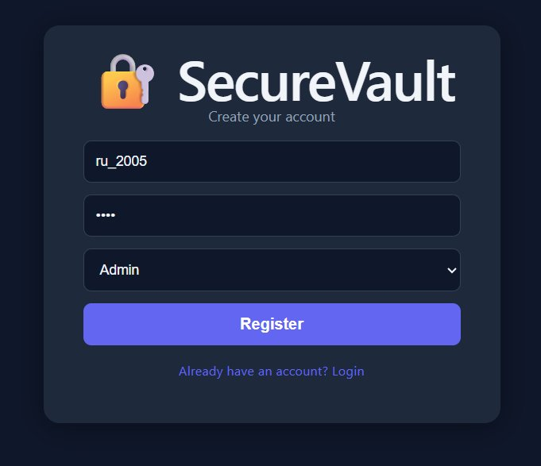

# SecureVault 🔐

A Role-Based Access Control (RBAC) web app I built for my HENNGE Global Internship application. The idea was simple — simulate how enterprise tools like HENNGE ONE handle secure access. Different users, different roles, different resources. No JWT token? No access.

**Live:** https://securevault-amber.vercel.app  
**API Docs:** https://securevault-qci0.onrender.com/docs

---

## How it works

You register with a role (Admin, Editor, or Viewer). After login, you only see what your role allows. Admins get an extra panel with system controls. Everything is behind JWT authentication.

---

## 📸 Screenshots

### Register — pick your role at signup



### Login page



### After registering, redirects to login with a success message



### Viewer dashboard — only view-files



### Editor dashboard — gets edit-files, view-files, and analytics



### Admin dashboard — full access + Admin Panel button



### Admin Panel — Manage Users, View Analytics, System Settings, Security Logs



### Registering as different roles

| Register | Register as Admin | Register as Editor |
|---|---|---|
|  |  |  |

---

## Role Permissions

| Role | What they can access |
|---|---|
| Admin | user-management, all-files, settings, analytics + admin panel |
| Editor | edit-files, view-files, analytics |
| Viewer | view-files |

---

## Stack

**Backend**
- FastAPI + Python
- JWT auth with python-jose
- bcrypt for password hashing
- SQLite via SQLAlchemy
- Pytest — 12 tests, all passing

**Frontend**
- React + TypeScript
- Vite
- Axios + React Router

**Infrastructure**
- Docker + docker-compose
- GitHub Actions CI (runs tests on every push)
- Render (backend) + Vercel (frontend)

---

## Project Structure

```
securevault/
├── backend/
│   ├── main.py          # routes
│   ├── auth.py          # JWT + password logic
│   ├── database.py      # SQLAlchemy setup
│   ├── models.py        # Pydantic schemas
│   ├── requirements.txt
│   └── tests/
│       ├── test_auth.py
│       └── test_routes.py
├── frontend/
│   └── src/
│       └── pages/
│           ├── Login.tsx
│           ├── Dashboard.tsx
│           └── Admin.tsx
├── docker-compose.yml
└── .github/
    └── workflows/
        └── ci.yml
```

---

## Run Locally

### Backend
```bash
cd backend
python -m venv venv
source venv/Scripts/activate  # on Windows
pip install -r requirements.txt
uvicorn main:app --reload
```

### Frontend
```bash
cd frontend
npm install
npm run dev
```

Open `http://localhost:5173`

### Or just Docker
```bash
docker-compose up --build
```

---

## API Endpoints

| Method | Endpoint | Who can use it |
|---|---|---|
| POST | /register | Public |
| POST | /login | Public |
| GET | /dashboard | Any logged in user |
| GET | /admin | Admin only |
| GET | /editor | Admin + Editor |

---

## Tests

```bash
cd backend
pytest tests/ -v
```

Covers registration, login, token validation, role access, duplicate users, wrong passwords — 12 tests total.

---

## Why I built this

I'm applying for HENNGE's Global Internship Program (Batch 4). HENNGE makes identity and access management tools for enterprises, so I wanted to actually build something in that space rather than just read about it. SecureVault is me trying to understand that problem from scratch — how do you decide who gets access to what, and how do you enforce it properly?

---

Built by **Aditi** — 3rd year BTech, Kanpur